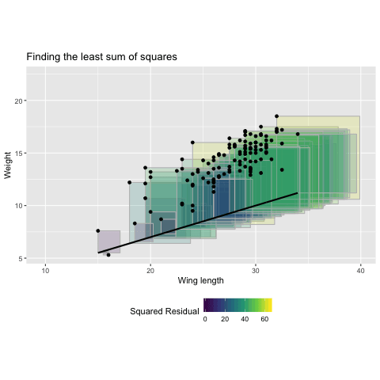

```{r child = "setup.Rmd"}
```
layout: true

<div class="my-footer">
<span>
Dr. Lucy D'Agostino McGowan
</span>
</div> 

---

```{r packages, echo=FALSE, message=FALSE, warning=FALSE}
library(tidyverse)
library(Stat2Data)
```

# Steps for modeling


---

# Steps for modeling


---

class: center, middle

# Data = Model + Error

---

class: center, middle

$\Huge y = f(x) + \epsilon$

---

class: center, middle

$\Huge y = f(x) + \epsilon$

## Simple linear regression

---
class: center, middle

$\Huge \color{blue}y = f(x) + \epsilon$

* **y:** continuous (quantitative) variable

<br><br><br>

### properties of simple linear regression

---

class: center, middle

$\Huge y = f(\color{blue}x) + \epsilon$

* **x:** continuous (quantitative) variable

<br><br><br>

### properties of simple linear regression

---

class: center, middle

$\Huge y = \color{blue}{f(x)} + \epsilon$

* **f(x):** a function that gives the mean value of $y$ at any value of $x$

<br><br><br>

### properties of simple linear regression

---

class: middle 

.definition[
**function**: a function is the relationship between a set of inputs to a set of outputs
]

--

- For example, $y = 1.5 + 0.5x$ is a function where $x$ is the input and $y$ is the output
--

- If you plug in $2$ for $x$: $y = 1.5 + 0.5 \times 2\rightarrow y = 1.5 + 1 \rightarrow y = 2.5$ 
---

.question[
What function do you think we are using get the mean value of $y$ with simple **linear** regression?
]

---

.question[
What function do you think we are using get the mean value of $y$ with simple **linear** regression?
]

```{r, echo = FALSE}
data(Sparrows)
ggplot(Sparrows, aes(x = WingLength, y = Weight)) + 
  geom_point() + 
  geom_smooth(method = "lm") +
  labs(title = "The relationship between weight and wing length", 
       subtitle = "Savannah Sparrows on Kent Island",
       x = "Wing length")
```

---

class: center, middle

## We express the mean weight of sparrows as a _linear function_ of wing length.

---

.question[ 
What is the equation that represents this line?
]

```{r, echo = FALSE}
ggplot(Sparrows, aes(x = WingLength, y = Weight)) + 
  geom_smooth(method = "lm") +
  labs(title = "The relationship between weight and wing length", 
       subtitle = "Savannah Sparrows on Kent Island",
       x = "Wing length")
```

---

# y = mx + b

```{r, echo = FALSE}
ggplot(Sparrows, aes(x = WingLength, y = Weight)) + 
  geom_smooth(method = "lm") +
  labs(title = "The relationship between weight and wing length", 
       subtitle = "Savannah Sparrows on Kent Island",
       x = "Wing length")
```

---

# $y = \beta_0 + \beta_1 x$

```{r, echo = FALSE}
ggplot(Sparrows, aes(x = WingLength, y = Weight)) + 
  geom_smooth(method = "lm") +
  labs(title = "The relationship between weight and wing length", 
       subtitle = "Savannah Sparrows on Kent Island",
       x = "Wing length")
```

---
# $y = \beta_0 + \beta_1 \times \textrm{Wing Length}$

```{r, echo = FALSE}
ggplot(Sparrows, aes(x = WingLength, y = Weight)) + 
  geom_smooth(method = "lm") +
  labs(title = "The relationship between weight and wing length", 
       subtitle = "Savannah Sparrows on Kent Island",
       x = "Wing length")
```

---
## $\textrm{Weight} = \beta_0 + \beta_1 \times \textrm{Wing Length}$

```{r, echo = FALSE}
ggplot(Sparrows, aes(x = WingLength, y = Weight)) + 
  geom_smooth(method = "lm") +
  labs(title = "The relationship between weight and wing length", 
       subtitle = "Savannah Sparrows on Kent Island",
       x = "Wing length")
```
---

.large[.question[
What is $\beta_0$?
]
]

```{r, echo = FALSE}
ggplot(Sparrows, aes(x = WingLength, y = Weight)) + 
  geom_smooth(method = "lm") +
  labs(title = "The relationship between weight and wing length", 
       subtitle = "Savannah Sparrows on Kent Island",
       x = "Wing length")
```
---
.large[.question[
What is $\beta_0$?
]
]

```{r, echo = FALSE}
tibble(
  WingLength = seq(0, 35, by = 1),
  Weight = lm(Weight ~ WingLength, data = Sparrows) %>%
    predict(newdata = data.frame(WingLength = seq(0, 35, by = 1))) 
) %>%
  ggplot(aes(WingLength, Weight)) + 
  geom_smooth(method = "lm") + 
  geom_vline(xintercept = 0) + 
  geom_point(aes(y = 1.3655, x = 0), color = "red", size = 3) + 
  labs(title = "The relationship between weight and wing length", 
       subtitle = "Savannah Sparrows on Kent Island",
       x = "Wing length")
```

---

.large[
.question[
What is $\beta_1$?
]
]

```{r, echo = FALSE}
ggplot(Sparrows, aes(x = WingLength, y = Weight)) + 
  geom_smooth(method = "lm") +
  labs(title = "The relationship between weight and wing length", 
       subtitle = "Savannah Sparrows on Kent Island",
       x = "Wing length")
```

---

.large[
.question[
What is $\beta_1$?
]
]

```{r, echo = FALSE}
ggplot(Sparrows, aes(x = WingLength, y = Weight)) + 
  geom_smooth(method = "lm") +
  labs(title = "The relationship between weight and wing length", 
       subtitle = "Savannah Sparrows on Kent Island",
       x = "Wing length") + 
  geom_segment(aes(x = 20, y = 17, xend = 25, yend = 14), arrow = arrow(length = unit(0.1, "cm")))
```
---
class: center, middle

## Do all of the data points actually fall exactly on the line?

---
class: center, middle

## $y = \beta_0 + \beta_1x + \color{red}{\epsilon}$

---
## $y = \beta_0 + \beta_1x + \color{red}\epsilon$


```{r, echo = FALSE}
ggplot(Sparrows, aes(x = WingLength, y = Weight)) + 
  geom_point() + 
  geom_smooth(method = "lm") +
  labs(title = "The relationship between weight and wing length", 
       subtitle = "Savannah Sparrows on Kent Island",
       x = "Wing length")
```

---
## $y = \beta_0 + \beta_1x + \color{red}\epsilon$


```{r, echo = FALSE}
Sparrows$fitted <- fitted(lm(Weight ~ WingLength, data = Sparrows))
ggplot(Sparrows, aes(x = WingLength, y = Weight)) + 
  geom_segment(aes(x = WingLength, y = Weight, xend = WingLength, yend = fitted),
               color = "red") +
  geom_point() + 
  geom_smooth(method = "lm") +
  labs(title = "The relationship between weight and wing length", 
       subtitle = "Savannah Sparrows on Kent Island",
       x = "Wing length")
```

---

# Truth


$\Huge y = \beta_0 + \beta_1x + \epsilon$


---

# Truth

$\Huge y = \beta_0 + \beta_1x + \epsilon$

.definition[
If we had the **whole population** of sparrows we could quantify the exact relationship between $y$ and $x$
]
---

# Reality

$\Huge \hat{y} = \hat{\beta_0} + \hat{\beta_1}x + \epsilon$


---

# Reality

$\Huge \hat{y} = \hat{\beta_0} + \hat{\beta_1}x + \epsilon$

.definition[
In reality, we have a **sample** of sparrows to **estimate** the relationship between $x$ and $y$. The "hats" represent that these are estimated (fitted) values
]

---

# Put a hat on it

.question[
How can you tell the difference between a **parameter** that is from the **whole population** versus a **sample**?
]


---

class: center, middle
# Pause for definitions
---

# Definitions

- **parameters**
- $\beta_0$
- $\beta_1$
- **population** versus **sample**
- **simple linear model**

---

# Definitions

- **parameters**: $\beta_0$, $\beta_1$
- $\beta_0$: intercept
- $\beta_1$: slope
- **population** versus **sample**
- **simple linear model**: $y = \beta_0 + \beta_1x + \epsilon$

---
class: center, middle

# Let's do this in R

---

```{r}
library(Stat2Data)
data(Sparrows)

lm(Weight ~ WingLength, data = Sparrows) #<<
```

---

.question[
What is $\beta_0$?
]

```{r}
lm(Weight ~ WingLength, data = Sparrows)
```

---

.question[
What is $\beta_1$?
]

```{r}
lm(Weight ~ WingLength, data = Sparrows)
```

---

```{r}
y_hat <- lm(Weight ~ WingLength, data = Sparrows) %>%
  predict() #<<
```

---

```{r}
y_hat <- lm(Weight ~ WingLength, data = Sparrows) %>%
  predict() 

Sparrows %>%
  mutate(y_hat = y_hat) %>% #<<
  select(WingLength, y_hat) %>%
  slice(1:5)
```

---

class: center, middle

# Let's try to match these values using $\beta_0$ and $\beta_1$

---

```{r}
lm(Weight ~ WingLength, data = Sparrows)
```

# $1.365 + 0.4674 \times 29$

---


```{r}
lm(Weight ~ WingLength, data = Sparrows)
```

# $1.365 + 0.4674 \times 29 = 14.92$

---

# How'd we do?

```{r}
y_hat <- lm(Weight ~ WingLength, data = Sparrows) %>%
  predict() 

Sparrows %>%
  mutate(y_hat = y_hat) %>%
  select(WingLength, y_hat) %>%
  slice(1:5)
```

---

.question[
How did we decide on THIS line?
]

```{r, echo = FALSE}
Sparrows$fitted <- fitted(lm(Weight ~ WingLength, data = Sparrows))
ggplot(Sparrows, aes(x = WingLength, y = Weight)) + 
  geom_segment(aes(x = WingLength, y = Weight, xend = WingLength, yend = fitted),
               color = "red") +
  geom_point() + 
  geom_smooth(method = "lm") +
  labs(title = "The relationship between weight and wing length", 
       subtitle = "Savannah Sparrows on Kent Island",
       x = "Wing length")
```

---

## Minimizing Least Squares

```{r, echo = FALSE}
Sparrows$fitted <- fitted(lm(Weight ~ WingLength, data = Sparrows))
ggplot(Sparrows, aes(x = WingLength, y = Weight)) + 
  geom_segment(aes(x = WingLength, y = Weight, xend = WingLength, yend = fitted),
               color = "red") +
  geom_point() + 
  geom_smooth(method = "lm") +
  labs(title = "The relationship between weight and wing length", 
       subtitle = "Savannah Sparrows on Kent Island",
       x = "Wing length")
```

---

```{r, eval = FALSE, echo = FALSE}
library(gganimate)

params <- data.frame(b0 = c(1, 1, 2, 2, 1.2, 1.2, 1.3655),
                     b1 = c(0.3, 0.6, 0.3, 0.6, 0.3, 0.6, 0.4674))
sparrow_anim <- lapply(1:nrow(params), function(i) {
  b0 <- params$b0[i]
  b1 <- params$b1[i]
  record_anim <- Sparrows %>%
    mutate(weight_pred = b0 + b1 * WingLength,
           residual = Weight - weight_pred,
           residual2 = residual ^ 2,
           m_Weight = mean(Weight),
           param_b0 = b0,
           param_b1 = b1,
           state = i)
  return(record_anim)
}) %>% bind_rows()


ggplot(sparrow_anim) +
  geom_rect(aes(xmin = WingLength, xmax = WingLength + residual,
                ymin = Weight, ymax = weight_pred, fill = residual ^ 2), color = "grey", alpha = 0.2) +
  geom_point(aes(x = WingLength, y = Weight)) +
  geom_line(aes(x = WingLength, y = weight_pred), color = "black", size = 1) +
  scale_fill_viridis_c("Squared Residual") +
  scale_x_continuous("Wing length") +
  scale_y_continuous("Weight") +
  coord_fixed() +
  theme(legend.position = "bottom") +
  transition_states(state, transition_length = 3, state_length = 1) +
  labs(title = "Finding the least sum of squares") +
  ease_aes("sine-in-out")
```

---