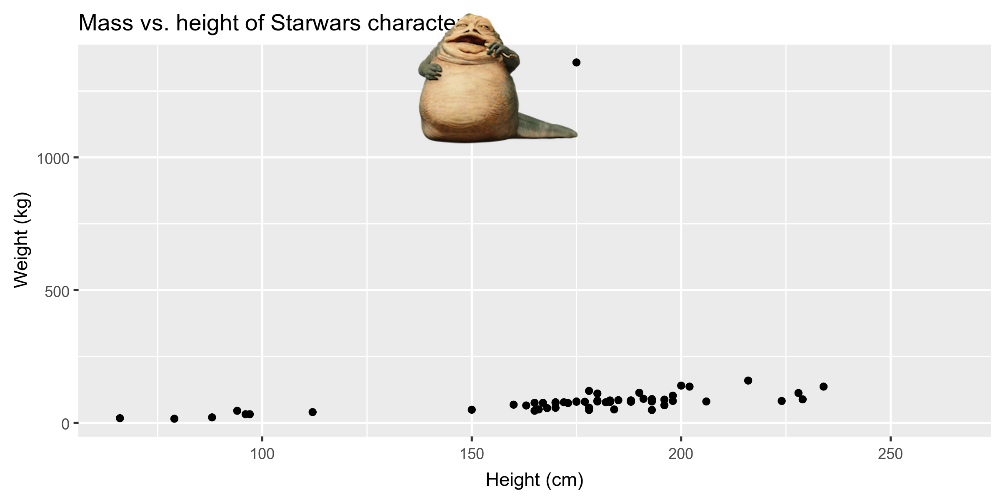

```{r child = "setup.Rmd"}
```
layout: true

<div class="my-footer">
<span>
Dr. Lucy D'Agostino McGowan
</span>
</div> 

---

## <i class="fas fa-laptop"></i> `Starwars (2)`

- Go to RStudio Cloud and open `Starwars (2)`
---

```{r, include = FALSE, echo = FALSE}
library(tidyverse)
knitr::opts_chunk$set(echo = FALSE, message = FALSE, warning = FALSE)
```


## Definitions

.question[
How does your book define an "outlier"?
]

---

## Definitions

.question[
How does your book define an "influential point"?
]

---

```{r}

```

---

## Example

```{r, echo = TRUE}
lm(mass ~ height, data = starwars)
```

---

## Example

.small[
```{r, echo = TRUE, fig.height = 2}
y_hat <- lm(mass ~ height, data = starwars) %>%
  predict()

starwars %>%
  filter(!is.na(height) & !is.na(mass)) %>%
  mutate(residual = mass - y_hat) %>%
  ggplot(aes(y_hat, residual)) + 
  geom_point() + 
  geom_hline(yintercept = 0)
```
]

---

## Example

.question[
What does this line of code do?
]

```{r, echo = TRUE, eval = FALSE}
y_hat <- lm(mass ~ height, data = starwars) %>%
  predict()

starwars %>%
  filter(!is.na(height) & !is.na(mass)) %>% #<<
  mutate(residual = mass - y_hat) %>%
  ggplot(aes(y_hat, residual)) + 
  geom_point() + 
  geom_hline(yintercept = 0)
```

---

## Example

.question[
What does this line of code do?
]

```{r, echo = TRUE, eval = FALSE}
y_hat <- lm(mass ~ height, data = starwars) %>%
  predict()

starwars %>%
  filter(!is.na(height) & !is.na(mass)) %>% 
  mutate(residual = mass - y_hat) %>%
  ggplot(aes(y_hat, residual)) + 
  geom_point() + 
  geom_hline(yintercept = 0) #<<
```

---


## Example

.question[
Is this an outlier?
]

```{r}
y_hat <- lm(mass ~ height, data = starwars) %>%
  predict()

starwars %>%
  filter(!is.na(height) & !is.na(mass)) %>% 
  mutate(residual = mass - y_hat) %>%
  ggplot(aes(y_hat, residual)) + 
  geom_point() + 
  geom_hline(yintercept = 0) 
```

---

## Example

Gold-medal-winning distances (m) for the men's Olympic long jump, 1900–2008

```{r, message = FALSE, warning = FALSE}
library(Stat2Data)
data("LongJumpOlympics")

ggplot(LongJumpOlympics, aes(Year, Gold)) + 
  geom_point()
  
```

---

## Example

Gold-medal-winning distances (m) for the men's Olympic long jump, 1900–2008

```{r}
LongJumpOlympics %>%
  mutate(y_hat = lm(Gold ~ Year, data = .) %>% predict(),
         residual = Gold - y_hat) %>%
  ggplot(aes(y_hat, residual)) +
  geom_point() + 
  geom_hline(yintercept = 0) + 
  labs(x = "predicted")
```

---

## Example

Gold-medal-winning distances (m) for the men's Olympic long jump, 1900–2008

```{r}
LongJumpOlympics %>%
  mutate(y_hat = lm(Gold ~ Year, data = .) %>% predict(),
         residual = Gold - y_hat, 
         color = ifelse(residual > 0.6, "red", "black")) %>%
  ggplot(aes(y_hat, residual, color = color)) +
scale_color_manual(values = c("black", "red")) +
  theme(legend.position = "none") + 
  geom_point() + 
  geom_hline(yintercept = 0) + 
  labs(x = "predicted")
```

---

class: center, middle

## How can we tell if a residual is "unusually" large?

---

class: center, middle

## How can we tell if a residual is "unusually" large?
### Do we have a "typical" error we can standardize by?

---

## Standardize residuals

* $\hat{\sigma}_\epsilon$: reflects the typical error
--

* $\Large\frac{\textrm{residual}}{\hat{\sigma}_\epsilon}$
--

* $\Large{\frac{y - \hat{y}}{\hat{\sigma}_\epsilon}}$
---

## Studentized residuals

* Another option is to estimate the standard deviation of the regression error using a model that is fit **after omitting the point in question**

--
* In R: `rstudent()`

---

## Example

.question[
What is `model`?
]

```{r, echo = TRUE}
model <- lm(Gold ~ Year, data = LongJumpOlympics) 
```

---

## Example

```{r, echo = TRUE}
model <- lm(Gold ~ Year, data = LongJumpOlympics) 
y_hat <- model %>%
  predict()
```

--

```{r, echo = TRUE}
y_hat <- lm(Gold ~ Year, data = LongJumpOlympics) %>%
  predict()
```

--

```{r, echo = TRUE, eval = FALSE}
LongJumpOlympics %>%
  mutate(y_hat = model %>% predict())
```

---

## Example

```{r, echo = TRUE}
model <- lm(Gold ~ Year, data = LongJumpOlympics)

LongJumpOlympics %>%
  mutate(y_hat = model %>% predict(),
         stud_resid = model %>% rstudent()) #<<
```

---

## Example 

.small[
```{r, echo = TRUE, fig.height = 2}
model <- lm(Gold ~ Year, data = LongJumpOlympics)

LongJumpOlympics %>%
  mutate(y_hat = model %>% predict(),
         stud_resid = model %>% rstudent()) %>%
  ggplot(aes(Year, stud_resid)) + 
  geom_point() + 
  geom_hline(yintercept = c(2, 4, -2, -4), lty = 2) + 
  labs(y = "studentized residual")
```
]

---

## Influential points

.question[
Would removing the observation from the dataset change the regression equation by much?
]

---

## Example

.small[
```{r, echo = TRUE}
lm(mass ~ height, data = starwars)
```
]
.small[
```{r, echo = TRUE}
starwars %>%
  filter(name != "Jabba Desilijic Tiure") %>% #<<
  lm(mass ~ height, data = .)
```

]
---

## Example

```{r}
ggplot(starwars, aes(height, mass)) + 
  geom_point() +
  geom_line(aes(height, -13.8103 + 0.6386 * height)) + 
  geom_line(aes(height, -32.5408 + 0.6214 * height), lty = 2)
```

---

## <i class="fas fa-laptop"></i> `Starwars (2)`

- Go to RStudio Cloud and open `Starwars (2)`
- For each question you work on, set the `eval` chunk option to `TRUE` and knit
