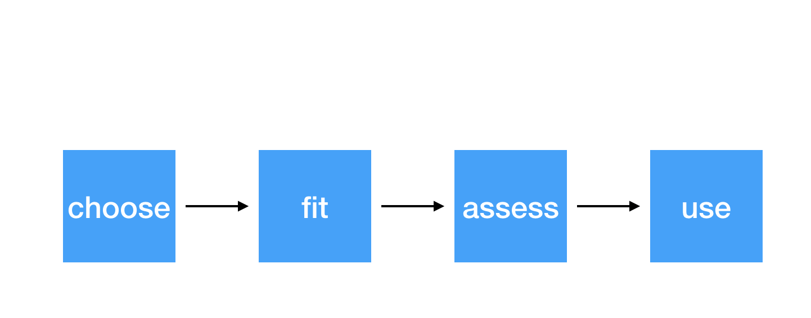

```{r child = "setup.Rmd"}
```
layout: true

<div class="my-footer">
<span>
Dr. Lucy D'Agostino McGowan
</span>
</div> 

```{r, echo = FALSE}
knitr::opts_chunk$set(echo = FALSE)
```

---
## <i class="fas fa-laptop"></i> `Species Area`

- Go to RStudio Cloud and open `Species Area`

---
# Steps for modeling



---

# Steps for modeling


---

# Conditions for simple linear regression

* Linearity
* Zero Mean
* Constant Variance
* Independence
* Random
* Normality

---

# Conditions for simple linear regression

.question[
What can we do when these conditions aren't met?
]
* Linearity
* Zero Mean
* Constant Variance
* Independence
* Random
* Normality

---

class: center, middle

# transformations!

---

## Example

Number of MDs and community hospitals for sample of 83 metropolitan areas

```{r, message = FALSE, warning = FALSE, echo = FALSE}
library(Stat2Data)
library(tidyverse)
data("MetroHealth83")
```

.small[
```{r}
MetroHealth83 %>%
  select(City, NumMDs, NumHospitals) %>%
  head(10) %>%
  knitr::kable(format = "markdown")
```
]

---

## Example

Number of MDs and community hospitals for sample of 83 metropolitan areas

```{r}
ggplot(MetroHealth83, aes(NumHospitals, NumMDs)) + 
  geom_point() + 
  labs(title = "Scatterplot for Doctors versus Hospitals",
       x = "Number of Hospitals",
       y = "Number of MDs")
```


---

## Choose 

Number of MDs and community hospitals for sample of 83 metropolitan areas

### $\hat{\textrm{Number of MDs}} = \hat{\beta}_0 + \hat{\beta}_1 \textrm{Number of hospitals}$

---
## Fit

Number of MDs and community hospitals for sample of 83 metropolitan areas

```{r, echo = TRUE}
lm(NumMDs ~ NumHospitals, data = MetroHealth83)
```
---

## Fit

Number of MDs and community hospitals for sample of 83 metropolitan areas

.question[
Refresher: What is $\hat{\beta}_0$ and what does it mean?
]

```{r, echo = TRUE}
lm(NumMDs ~ NumHospitals, data = MetroHealth83)
```

---
## Fit

Number of MDs and community hospitals for sample of 83 metropolitan areas

.question[
Refresher: What is $\hat{\beta}_1$ and what does it mean?
]

```{r, echo = TRUE}
lm(NumMDs ~ NumHospitals, data = MetroHealth83)
```

---

## Assess

Number of MDs and community hospitals for sample of 83 metropolitan areas

.question[
What can I use to assess the linearity and constant variance assumptions?
]

---

## Assess

Number of MDs and community hospitals for sample of 83 metropolitan areas

.question[
What can I use to assess the linearity and constant variance assumptions?
]

```{r, fig.height = 2}
MetroHealth83 %>%
  mutate(y_hat = lm(NumMDs ~ NumHospitals, data = .) %>% predict(),
         residual = NumMDs - y_hat) %>%
  ggplot(aes(y_hat, residual)) + 
  geom_point() + 
  geom_hline(yintercept = 0) + 
  labs(title = "Residuals versus fits plot", 
       x = "predicted MDs")
```

---
## Assess

Number of MDs and community hospitals for sample of 83 metropolitan areas

.question[
What do you think?
]

```{r, fig.height = 2}
MetroHealth83 %>%
  mutate(y_hat = lm(NumMDs ~ NumHospitals, data = .) %>% predict(),
         residual = NumMDs - y_hat) %>%
  ggplot(aes(y_hat, residual)) + 
  geom_point() + 
  geom_hline(yintercept = 0) + 
  labs(title = "Residuals versus fits plot", 
       x = "predicted MDs")
```
---

## Assess

Number of MDs and community hospitals for sample of 83 metropolitan areas

.question[
What can I use to assess the normality assumption?
]

---
## Assess

Number of MDs and community hospitals for sample of 83 metropolitan areas

.question[
What do you think?
]

```{r, fig.height = 2}
MetroHealth83 %>%
  mutate(y_hat = lm(NumMDs ~ NumHospitals, data = .) %>% predict(),
         residual = NumMDs - y_hat) %>%
  ggplot(aes(residual)) + 
  geom_histogram(bins = 30) + 
  labs(title = "Histogram of the residuals")
```

---

## Assess

Number of MDs and community hospitals for sample of 83 metropolitan areas

.question[
What do you think?
]

```{r, fig.height = 2}
MetroHealth83 %>%
  mutate(y_hat = lm(NumMDs ~ NumHospitals, data = .) %>% predict(),
         residual = NumMDs - y_hat) %>%
  ggplot(aes(sample = residual)) + 
  geom_qq() + 
  geom_qq_line() +
  labs(title = "Normal Quantile Plot")
```
---

## Choose

* to **stabilize** the variance of the response ( $y$, in this case `NumMDs`) across different values of the predictor ( $x$, in this case `NumHospitals`), we can **transform** $y$ or $x$
--

* typical transformations: 
    * $\sqrt{y}$
    * $\log{y}$
    * $x^2$
    * $1/x$
--
* For count data, such as the number of doctors or hospitals where the variability increases along with the magnitudes of the variables, a **square root transformation** is often helpful

---

## Choose

Number of MDs and community hospitals for sample of 83 metropolitan areas

### $\hat{\sqrt{\textrm{Number of MDs}}} = \hat{\beta}_0 + \hat{\beta}_1 \textrm{Number of hospitals}$

---

## Fit

Number of MDs and community hospitals for sample of 83 metropolitan areas

```{r, echo = TRUE}
lm(sqrt(NumMDs) ~ NumHospitals, data = MetroHealth83)
```

---

## Assess

```{r}
MetroHealth83 %>%
  mutate(y_hat = lm(sqrt(NumMDs) ~ NumHospitals, data = .) %>% predict(),
         residual = sqrt(NumMDs) - y_hat) %>%
  ggplot(aes(y_hat, residual)) + 
  geom_point() + 
  geom_hline(yintercept = 0) + 
  labs(title = "Residuals versus fits plot", 
       x = "predicted square root # of MDs")
```

---

## Assess

```{r, fig.height = 2}
MetroHealth83 %>%
  mutate(y_hat = lm(sqrt(NumMDs) ~ NumHospitals, data = .) %>% predict(),
         residual = sqrt(NumMDs) - y_hat) %>%
  ggplot(aes(residual)) + 
  geom_histogram(bins = 10) + 
  labs(title = "Histogram of the residuals")
```

```{r, fig.height = 2}
MetroHealth83 %>%
  mutate(y_hat = lm(sqrt(NumMDs) ~ NumHospitals, data = .) %>% predict(),
         residual = sqrt(NumMDs) - y_hat) %>%
  ggplot(aes(sample = residual)) + 
  geom_qq() + 
  geom_qq_line() +
  labs(title = "Normal Quantile Plot")
```
---

## Use

Number of MDs and community hospitals for sample of 83 metropolitan areas

### $\hat{\sqrt{\textrm{Number of MDs}}} = \hat{\beta}_0 + \hat{\beta}_1 \textrm{Number of hospitals}$

### $\hat{\textrm{Number of MDs}} = (\hat{\beta}_0 + \hat{\beta}_1 \textrm{Number of hospitals})^2$

---

## Use

### $\hat{\textrm{Number of MDs}} = (\hat{\beta}_0 + \hat{\beta}_1 \textrm{Number of hospitals})^2$

```{r, highlight.output = 7}
lm(sqrt(NumMDs) ~ NumHospitals, data = MetroHealth83)
```

```{r, highlight.output = 2}
MetroHealth83 %>%
  slice(2) %>%
  select(City, NumMDs, NumHospitals)
```
---

## Use

### $\hat{\textrm{Number of MDs}} = (\hat{\beta}_0 + \hat{\beta}_1 \textrm{Number of hospitals})^2$

```{r, highlight.output = 7}
lm(sqrt(NumMDs) ~ NumHospitals, data = MetroHealth83)
```

```{r, highlight.output = 2}
MetroHealth83 %>%
  slice(2) %>%
  select(City, NumMDs, NumHospitals)
```

```{r, echo = TRUE}
(14.033 + 2.915 * 18)^2
```

---

## Use

```{r}
MetroHealth83 %>%
  mutate(y_hat = lm(sqrt(NumMDs) ~ NumHospitals, data = .) %>% predict) %>%
ggplot(aes(NumHospitals, NumMDs)) + 
  geom_point() + 
  geom_line(aes(NumHospitals, y_hat^2))
```

---

## <i class="fas fa-laptop"></i> `Species Area`

- Go to RStudio Cloud and open `Species Area`
- For each question you work on, set the `eval` chunk option to `TRUE` and knit
