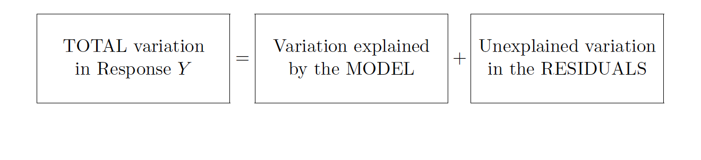

```{r child = "setup.Rmd"}
```
layout: true

<div class="my-footer">
<span>
by Dr. Lucy D'Agostino McGowan
</span>
</div> 

---

```{r packages, echo=FALSE, message=FALSE, warning=FALSE}
library(tidyverse)
library(broom)
```

## <i class="fas fa-laptop"></i> `Porsche Price (3)`

- Go to RStudio Cloud and open `Porsche Price (3)`

---
class: middle

# in·fer·ence
a conclusion reached on the basis of evidence and reasoning.

---
# Inference

* so far we've only been able to make claims about our sample
--

* for example, we've just been describing $\hat{\beta}_1$, the _estimated_ slope of the relationship between $x$ and $y$.
--

* what if we want to extend these claims to the population?

---

# Sparrow data

_So far, we've been looking at a sample of 116 sparrows from Kent Island._ 

```{r, echo = FALSE, message = FALSE, warning = FALSE}
library(Stat2Data)
data("Sparrows")
ggplot(Sparrows, aes(x = WingLength, y = Weight)) + 
  geom_point() + 
  labs(title = "The relationship between weight and wing length", 
       subtitle = "Savannah Sparrows on Kent Island",
       x = "Wing length")
```

---

## Sparrows

.question[
What if this were the true population, and the sample that we saw was just related _by chance_?
]

```{r, echo = FALSE, message = FALSE, warning = FALSE}
set.seed(1)
ggplot(Sparrows, aes(x = WingLength, y = Weight)) + 
  geom_point(data = data.frame(x = rnorm(600, 27, 4),
                               y = rnorm(600, 14, 3)),
             aes(x = x, y = y), pch = 1) +
  geom_point(color = "red") +
  labs(title = "The relationship between weight and wing length", 
       subtitle = "Savannah Sparrows on Kent Island",
       x = "Wing length")
```

---

## Sparrows

.question[
Ultimately What do we want to know?
]


```{r, echo = FALSE, message = FALSE, warning = FALSE, fig.height = 2}
ggplot(Sparrows, aes(x = WingLength, y = Weight)) + 
  geom_point() + 
  labs(title = "The relationship between weight and wing length", 
       subtitle = "Savannah Sparrows on Kent Island",
       x = "Wing length")
```

---

## Sparrows

.question[
Ultimately What do we want to know?
]

```{r, echo = FALSE, message = FALSE, warning = FALSE, fig.height = 2}
ggplot(Sparrows, aes(x = WingLength, y = Weight)) + 
  geom_point() + 
  labs(title = "The relationship between weight and wing length", 
       subtitle = "Savannah Sparrows on Kent Island",
       x = "Wing length")
```

* Does the slope in the **population** differ from 0?

---

## Sparrows

.question[
Ultimately What do we want to know?
]

```{r, echo = FALSE, message = FALSE, warning = FALSE, fig.height = 2}
ggplot(Sparrows, aes(x = WingLength, y = Weight)) + 
  geom_point() + 
  labs(title = "The relationship between weight and wing length", 
       subtitle = "Savannah Sparrows on Kent Island",
       x = "Wing length")
```

* Does $\beta_1$ differ from 0?
--

* _notice the lack of a hat!_
---

## Sparrows

.question[
Ultimately What do we want to know?
]

```{r, echo = FALSE, message = FALSE, warning = FALSE, fig.height = 2}
ggplot(Sparrows, aes(x = WingLength, y = Weight)) + 
  geom_point() + 
  labs(title = "The relationship between weight and wing length", 
       subtitle = "Savannah Sparrows on Kent Island",
       x = "Wing length")
```

* **null hypothesis** $H_0: \beta_1 = 0$ 
* **alternative hypothesis** $H_A: \beta_1 \ne 0$

---

## Sparrows

.question[
How can we quantify how much we'd expect the slope to differ from one random sample to another?
]

```{r, echo = FALSE, message = FALSE, warning = FALSE, fig.height = 2}
ggplot(Sparrows, aes(x = WingLength, y = Weight)) + 
  geom_point() + 
  labs(title = "The relationship between weight and wing length", 
       subtitle = "Savannah Sparrows on Kent Island",
       x = "Wing length") +
  geom_smooth(method = "lm", se = FALSE)
```

---

## Sparrows

.question[
How can we quantify how much we'd expect the slope to differ from one random sample to another?
]

```{r, echo = FALSE, message = FALSE, warning = FALSE, fig.height = 2}
ggplot(Sparrows, aes(x = WingLength, y = Weight)) + 
  geom_point() + 
  labs(title = "The relationship between weight and wing length", 
       subtitle = "Savannah Sparrows on Kent Island",
       x = "Wing length") + 
  geom_smooth(method = "lm", fill = "blue")
```

* We need a measure of **uncertainty**

---

## Sparrows

.question[
How can we quantify how much we'd expect the slope to differ from one random sample to another?
]

```{r, echo = FALSE, message = FALSE, warning = FALSE, fig.height = 2}
ggplot(Sparrows, aes(x = WingLength, y = Weight)) + 
  geom_point() + 
  labs(title = "The relationship between weight and wing length", 
       subtitle = "Savannah Sparrows on Kent Island",
       x = "Wing length") + 
  geom_smooth(method = "lm", fill = "blue")
```

* How about the **standard error** of $\hat{\beta}_1$?

---

## Sparrows

.question[
How can we quantify how much we'd expect the slope to differ from one random sample to another?
]

```{r, echo = FALSE, message = FALSE, warning = FALSE, fig.height = 2}
ggplot(Sparrows, aes(x = WingLength, y = Weight)) + 
  geom_point() + 
  labs(title = "The relationship between weight and wing length", 
       subtitle = "Savannah Sparrows on Kent Island",
       x = "Wing length") + 
  geom_smooth(method = "lm", fill = "blue")
```

* the **standard error** of $\hat{\beta_1}$ ( $SE_{\hat{\beta}_1}$ ) is how much we expect the sample slope to vary from one random sample to another.

---

## Sparrows

.question[
How can we quantify how much we'd expect the slope to differ from one random sample to another?
]

.small[
```{r, highlight.output = 5}
lm(Weight ~ WingLength, data = Sparrows) %>%
  tidy()
```
]

---

## Sparrows

.question[
We need a **test statistic** that incorporates $\hat{\beta}_1$ and the standard error $SE_{\hat\beta_1}$
]

.small[
```{r, highlight.output = 5}
lm(Weight ~ WingLength, data = Sparrows) %>%
  tidy()
```
]

---

## Sparrows

.question[
We need a **test statistic** that incorporates $\hat{\beta}_1$ and the standard error $SE_{\hat\beta_1}$
]

.small[
```{r, highlight.output = 5}
lm(Weight ~ WingLength, data = Sparrows) %>%
  tidy()
```
]

# $t = \frac{\hat\beta_1}{SE_{\hat\beta_1}}$

---

## Sparrows

.question[
We need a **test statistic** that incorporates $\hat{\beta}_1$ and the standard error $SE_{\hat\beta_1}$
]

.small[
```{r, highlight.output = 5}
lm(Weight ~ WingLength, data = Sparrows) %>%
  tidy()
```
]

```{r}
0.467 / 0.0347
```

---

## Sparrows

.question[
How do we interpret this?
]

.small[
```{r, highlight.output = 5}
lm(Weight ~ WingLength, data = Sparrows) %>%
  tidy()
```
]

```{r}
0.467 / 0.0347
```

---

## Sparrows

.question[
How do we interpret this?
]

.small[
```{r, highlight.output = 5}
lm(Weight ~ WingLength, data = Sparrows) %>%
  tidy()
```
]

* "the sample slope is more than 13 standard errors above a slope of zero"

---

## Sparrows

.question[
How do we know what values of this statistic are worth paying attention to?
]

.small[
```{r, highlight.output = 5}
lm(Weight ~ WingLength, data = Sparrows) %>%
  tidy()
```
]

---

## Sparrows

.question[
How do we know what values of this statistic are worth paying attention to?
]

.small[
```{r, highlight.output = 5}
lm(Weight ~ WingLength, data = Sparrows) %>%
  tidy()
```
]

* confidence intervals
* p-values

---
## Sparrows

.question[
How do we know what values of this statistic are worth paying attention to?
]

.small[
```{r, highlight.output = 5}
lm(Weight ~ WingLength, data = Sparrows) %>%
  tidy(conf.int = TRUE)
```
]

* confidence intervals
* p-values

---

## Sparrows

.question[
Where do these come from?
]

.small[
```{r, highlight.output = 5}
lm(Weight ~ WingLength, data = Sparrows) %>%
  tidy(conf.int = TRUE)
```
]

* confidence intervals
* p-values

---

## Sparrows

.question[
What if we knew what the distribution of the "statistic" would be under the null hypothesis?
]

.small[
```{r, highlight.output = 5}
lm(Weight ~ WingLength, data = Sparrows) %>%
  tidy()
```
]

---

## Sparrows

```{r}
null_sparrow_data <- data.frame(
  WingLength = rnorm(10, 27, 4),
  Weight = rnorm(10, 14, 3)
)
lm(Weight ~ WingLength, data = null_sparrow_data) %>%
  tidy()
```

---

## Sparrows

```{r}
null_sparrow_data <- data.frame(
  WingLength = rnorm(10, 27, 4), #<<
  Weight = rnorm(10, 14, 3)
)
lm(Weight ~ WingLength, data = null_sparrow_data) %>%
  tidy()
```

---

## Sparrows

```{r}
null_sparrow_data <- data.frame(
  WingLength = rnorm(10, 27, 4),
  Weight = rnorm(10, 14, 3) #<<
)
lm(Weight ~ WingLength, data = null_sparrow_data) %>%
  tidy()
```

---

## Sparrows

.small[
```{r}
gen_null_stat <- function() { #<<
  null_sparrow_data <- data.frame(
    WingLength = rnorm(10, 27, 4),
    Weight = rnorm(10, 14, 3)
  )
  lm(Weight ~ WingLength, data = null_sparrow_data) %>%
    tidy() %>%
    filter(term == "WingLength") %>%
    select("statistic")
} #<<
```
]

```{r}
gen_null_stat()
```

---

## Sparrows

.small[
```{r}
gen_null_stat()
gen_null_stat()
gen_null_stat()
```
]

---

## Sparrows

```{r, cache = TRUE}
null_stats <- map_df(1:10000, ~ gen_null_stat())
```

---

## Sparrows

```{r, eval = FALSE}
null_stats <- map_df(1:10000, ~ gen_null_stat())
```

```{r, echo = FALSE}
ggplot(null_stats, aes(x = statistic)) +
  geom_histogram(bins = 70) + 
  labs(title = "Histogram of statistics under the null")
```

---

## Sparrows

.question[
What distribution does this look like?
]

```{r, echo = FALSE, fig.height = 2}
ggplot(null_stats) +
  geom_histogram(aes(x = statistic, y = ..density..), bins = 70) + 
  labs(title = "Histogram of statistics under the null")
```

---

## Sparrows

.question[
What distribution does this look like?
]

```{r, echo = FALSE, fig.height = 2}
normal_data <- null_stats %>%
  mutate(y_t = dt(statistic, df = 18),
         y_norm = dnorm(statistic, 0, 1))
ggplot(null_stats) +
  geom_histogram(aes(x = statistic, y = ..density..), bins = 70) + 
  geom_line(data = normal_data, aes(x = statistic, y = y_norm), color = "green") + 
  labs(title = "Histogram of statistics under the null",
       subtitle = "Overlaid with a Normal distribution")
```

* Normal?
--

* What distribution is similar to the normal but with fatter tails?

---

## Sparrows

.question[
What distribution does this look like?
]

```{r, echo = FALSE, fig.height = 2}
ggplot(null_stats) +
  geom_histogram(aes(x = statistic, y = ..density..), bins = 70) + 
  geom_line(data = normal_data, aes(x = statistic, y = y_t), color = "green") + 
  labs(title = "Histogram of statistics under the null",
       subtitle = "Overlaid with a t-distribution")
```

* the *t-distribution!*
--

* this is a **t-distribution** with **n-2** degrees of freedom.

---

## Sparrows

The distribution of test statistics we would expect given the **null hypothesis is true**, $\beta_1 = 0$, is **t-distribution** with **n-2** degrees of freedom.

```{r, echo = FALSE, fig.height = 2}
ggplot(null_stats) +
  geom_histogram(aes(x = statistic, y = ..density..), bins = 70) + 
  geom_line(data = normal_data, aes(x = statistic, y = y_t), color = "green") + 
    labs(title = "Histogram of statistics under the null",
       subtitle = "Overlaid with a t-distribution")
```

---

## Sparrows

```{r, echo = FALSE, fig.height = 2}
ggplot(null_stats) +
  geom_histogram(aes(x = statistic, y = ..density..), bins = 70) + 
  geom_line(data = normal_data, aes(x = statistic, y = y_t), color = "green") + 
    labs(title = "Histogram of statistics under the null",
       subtitle = "Overlaid with a t-distribution")
```

.small[
```{r, highlight.output = 5}
lm(Weight ~ WingLength, data = Sparrows) %>%
  tidy()
```
]

---

## Sparrows

```{r, echo = FALSE, fig.height = 2}
ggplot(null_stats) +
  geom_histogram(aes(x = statistic, y = ..density..), bins = 70) + 
  geom_line(data = normal_data, aes(x = statistic, y = y_t), color = "green") +
  geom_vline(xintercept = 13.463, lwd = 1.5) + 
    labs(title = "Histogram of statistics under the null",
       subtitle = "Overlaid with a t-distribution")
```

---

## Sparrows

.question[
How can we compare this line to the distribution under the null?
]

```{r, echo = FALSE, fig.height = 2}
ggplot(null_stats) +
  geom_histogram(aes(x = statistic, y = ..density..), bins = 70) + 
  geom_line(data = normal_data, aes(x = statistic, y = y_t), color = "green") +
  geom_vline(xintercept = 13.463, lwd = 1.5) + 
    labs(title = "Histogram of statistics under the null",
       subtitle = "Overlaid with a t-distribution")
```

--

* p-value

---

class: middle

# p-value

The probability of getting a statistic as extreme or more extreme than the observed test statistic **given the null hypothesis is true**

---

## Sparrows

```{r, echo = FALSE, fig.height = 2}
ggplot(null_stats) +
  geom_histogram(aes(x = statistic, y = ..density..), bins = 70) + 
  geom_line(data = normal_data, aes(x = statistic, y = y_t), color = "green") +
  geom_vline(xintercept = 13.463, lwd = 1.5) + 
  geom_vline(xintercept = -13.463, lwd = 1.5) +
    labs(title = "Histogram of statistics under the null",
       subtitle = "Overlaid with a t-distribution")
```

.small[
```{r, highlight.output = 5}
lm(Weight ~ WingLength, data = Sparrows) %>%
  tidy()
```
]

---

## Sparrows

```{r, echo = FALSE}
null_stats$shade <- ifelse(null_stats$statistic > 1.5 | null_stats$statistic < -1.5, TRUE, FALSE)
```

```{r, echo = FALSE, fig.height = 2}
ggplot(null_stats) +
  geom_histogram(aes(x = statistic, fill = shade), bins = 70) + 
  geom_vline(xintercept = 1.5, lwd = 1.5) + 
  geom_vline(xintercept = -1.5, lwd = 1.5) +
    labs(title = "Histogram of statistics under the null") + 
  theme(legend.position = "none")
```

* Statistic 1.5
---

## Let's do it in R!

The proportion of area less than 1.5

```{r, echo = FALSE, fig.height = 2}
null_stats$shade <- ifelse(null_stats$statistic < 1.5, TRUE, FALSE)
ggplot(null_stats) +
  geom_histogram(aes(x = statistic, fill = shade), bins = 70) + 
  geom_vline(xintercept = 1.5, lwd = 1.5) + 
    labs(title = "Histogram of statistics under the null") + 
  theme(legend.position = "none")
```


```{r}
pt(1.5, df = 18)
```

---

## Let's do it in R!

The proportion of area **greater** than 1.5

```{r, echo = FALSE, fig.height = 2}
null_stats$shade <- ifelse(null_stats$statistic > 1.5, TRUE, FALSE)
ggplot(null_stats) +
  geom_histogram(aes(x = statistic, fill = shade), bins = 70) + 
  geom_vline(xintercept = 1.5, lwd = 1.5) + 
    labs(title = "Histogram of statistics under the null") + 
  theme(legend.position = "none")
```


```{r}
pt(1.5, df = 18, lower.tail = FALSE)
```
---

## Let's do it in R!

The proportion of area **greater** than 1.5 **or** **less** than -1.5.

```{r, echo = FALSE, fig.height = 2}
null_stats$shade <- ifelse(null_stats$statistic > 1.5 | null_stats$statistic < - 1.5, TRUE, FALSE)
ggplot(null_stats) +
  geom_histogram(aes(x = statistic, fill = shade), bins = 70) + 
  geom_vline(xintercept = 1.5, lwd = 1.5) + 
    geom_vline(xintercept = -1.5, lwd = 1.5) + 
    labs(title = "Histogram of statistics under the null") + 
  theme(legend.position = "none")
```

--

```{r}
pt(1.5, df = 18, lower.tail = FALSE) * 2
```

---

class: middle

# p-value

The probability of getting a statistic as extreme or more extreme than the observed test statistic **given the null hypothesis is true**

---

## Hypothesis test

* **null hypothesis** $H_0: \beta_1 = 0$ 
* **alternative hypothesis** $H_A: \beta_1 \ne 0$
--

* **p-value**: 0.15
--

* Often, we have an $\alpha$-level cutoff to compare this to, for example **0.05**. Since this is greater than **0.05**, we **fail to reject the null hypothesis**

---

class: middle

# confidence intervals

If we use the same sampling method to select different samples and computed an interval estimate for each sample, we would expect the true population parameter ( $\beta_1$ ) to fall within the interval estimates 95% of the time.

---

# Confidence interval

.center[


$\Huge \hat\beta_1 \pm t^∗ \times SE_{\hat\beta_1}$

]

--

* $t^*$ is the critical value for the $t_n−2$ density curve to obtain the desired confidence level
--

* Often we want a **95% confidence level**.  

---

## Let's do it in R!

.small[
```{r, highlight.output = 5}
lm(Weight ~ WingLength, data = Sparrows) %>%
  tidy(conf.int = TRUE)
```
]

```{r}
qt(0.025, df = nrow(Sparrows) - 2, lower.tail = FALSE)
```
---

## Let's do it in R!

.question[
Why 0.025?
]

.small[
```{r, highlight.output = 5}
lm(Weight ~ WingLength, data = Sparrows) %>%
  tidy(conf.int = TRUE)
```
]

```{r}
qt(0.025, df = nrow(Sparrows) - 2, lower.tail = FALSE)
```

---

## Let's do it in R!

.question[
Why `lower.tail = FALSE`?
]

.small[
```{r, highlight.output = 5}
lm(Weight ~ WingLength, data = Sparrows) %>%
  tidy(conf.int = TRUE)
```
]

```{r}
qt(0.025, df = nrow(Sparrows) - 2, lower.tail = FALSE)
```

---

## Let's do it in R!


.small[
```{r, highlight.output = 5}
lm(Weight ~ WingLength, data = Sparrows) %>%
  tidy(conf.int = TRUE)
```
]

```{r, echo = FALSE}
options(digits = 3)
```

```{r}
c <- qt(0.025, df = nrow(Sparrows) - 2, lower.tail = FALSE)
0.467 + c * 0.0347
0.467 - c * 0.0347
```

---

class: middle

# confidence intervals

If we use the same sampling method to select different samples and computed an interval estimate for each sample, we would expect the true population parameter ( $\beta_1$ ) to fall within the interval estimates 95% of the time.

---

## <i class="fas fa-laptop"></i> `Porsche Price (3)`

- Go to RStudio Cloud and open `Porsche Price (3)`

---

# Partitioning variability



---

# Why?

* $\Huge y − \hat{y} = (\hat{y} − \bar{y}) + (y − \hat{y})$
--

* $\Large \sum(y − \hat{y})^2 = \sum(\hat{y} − \bar{y})^2 + \sum(y − \hat{y})^2$
--

* ## SSTotal = SSModel + SSE

---

# Degrees of freedom

* ## SSTotal: $n-1$
--

* ## SSE: $n-2$
--

* ## SSModel: $n-1 = 1 + (n-2)$ - so 1!
---

# Mean Squares

* $\Huge MSModel = \frac{SSModel}{1}$
--

* $\Huge MSE = \frac{SSE}{n-2}$

---

class: middle, center

$\Huge F = \frac{MSModel}MSE}$
