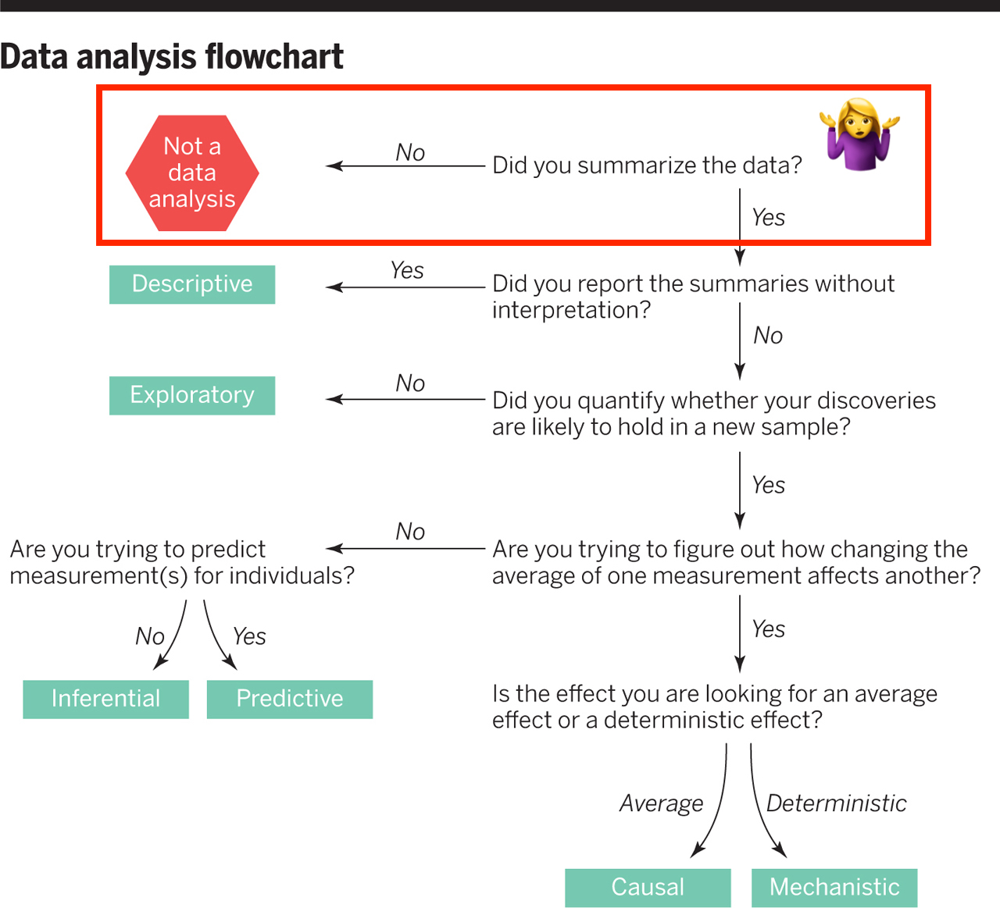
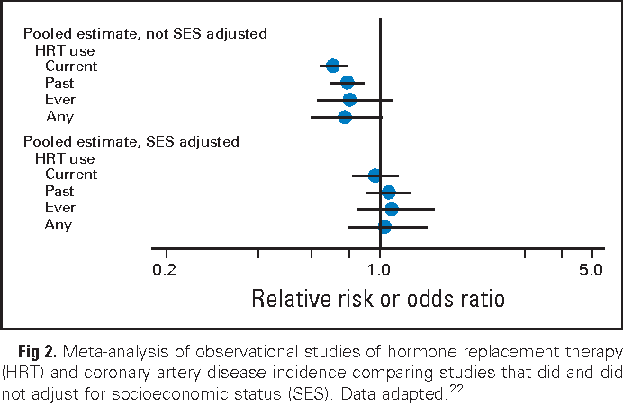

```{r child = "setup.Rmd"}
```
layout: true

<div class="my-footer">
<span>
by Dr. Lucy D'Agostino McGowan
</span>
</div> 

---

```{r packages, echo=FALSE, message=FALSE, warning=FALSE}
library(tidyverse)
library(broom)
library(Stat2Data)
library(ggdag)
library(datasauRus)
knitr::opts_chunk$set(echo = FALSE)
```

## Simple linear regression
<br><br>

.center[

$\Huge y = \beta_0 + \beta_1X + \epsilon$
<br><br>

$\Huge \epsilon\sim N(0,\sigma_\epsilon)$
]

---

## Multiple linear regression
<br><br>

.center[
$\Large y = \beta_0 + \beta_1X_1 + \beta_2X_2+\dots+\beta_kX_k+ \epsilon$ 
<br><br>
$\Huge \epsilon\sim N(0,\sigma_\epsilon)$

]

---

## Multiple linear regression

.question[
How are these coefficients estimated?
]

.center[
$\Large \hat{y} = \hat\beta_0 + \hat\beta_1X_1 + \hat\beta_2X_2+\dots+\hat\beta_kX_k$
]

--

* estimate coefficents that minimize the sum or squared residuals

---

## Let's do it in R!

* Data: Porsche Price
* Price, Mileage, Age

---

## Let's do it in R!

.question[
What is my response variable? What are my explantory variables?
]
* Data: Porsche Price
* Price, Mileage, Age

---

## Let's do it in R!

.small[
```{r, echo = TRUE}
data("PorschePrice")
lm(Price ~ Mileage + Age, data = PorschePrice)
```
]

---

## Let's do it in R!

.question[
What is different between this and the `lm()` functions we have been previously running?
]

.small[
```{r, echo = TRUE}
data("PorschePrice")
lm(Price ~ Mileage + Age, data = PorschePrice)
```
]

---


## Let's do it in R!

.question[
What is different between this and the `lm()` functions we have been previously running?
]

.small[
```{r, echo = TRUE, highlight.output = 6}
lm(Price ~ Mileage + Age, data = PorschePrice) %>%
  tidy()
```
]

---

## Let's do it in R!

.question[
How would we get the predicted values for $\hat{y}$?
]

.small[
```{r, echo = TRUE, highlight.output = 6}
lm(Price ~ Mileage + Age, data = PorschePrice) %>%
  tidy()
```
]

---

## Let's do it in R!

.question[
How would we get the predicted values for $\hat{y}$?
]

.small[
```{r, echo = TRUE}
lm(Price ~ Mileage + Age, data = PorschePrice) %>%
  predict()
```
]

---

## Let's do it in R!

.question[
The sample size is $n = 30$, what would the degrees of freedom for the SSE be now?
]

.center[
$\Large \sqrt{\frac{SSE}{??}}$
]

---

## Let's do it in R!

.question[
The sample size is $n = 30$, what would the degrees of freedom for the SSE be now?
]

.center[
$\Large \sqrt\frac{SSE}{n - k - 1}$
]

---

## Let's do it in R!

.question[
The sample size is $n = 30$, what would the degrees of freedom for the SSE be now?
]

.center[
$\Large\sqrt{ \frac{SSE}{30 - 2 - 1}}$
]

---

## Let's do it in R!

.small[
```{r, echo = TRUE, highlight.output = 7}
lm(Price ~ Mileage + Age, data = PorschePrice) %>% 
  anova()
```
]

---
class: center, middle

## Why might we want to do this?

---



http://science.sciencemag.org/content/347/6228/1314

---

class: center, middle

## Multiple linear regression for inference

---

## Multiple linear regression for inference

<br><br>
**Goal:** Discover the relationship between a response (outcome, $y$), and an explanatory variable ( $x$ )

---

## Multiple linear regression for inference

<br><br>
**Goal:** Discover the relationship between a response (outcome, $y$), and an explanatory variable ( $x$ ) **adjusting for all known confounders**

---

## Multiple linear regression for inference

.question[What is a confounder?]

<br><br>
**Goal:** Discover the relationship between a response (outcome, $y$), and an explanatory variable ( $x$ ) **adjusting for all known confounders**

---
class: middle

## confounder

A confounder is a variable that is associated with both the response variable ( $y$ ) and the explanatory variable ( $x$ ). If not accounted for, it can result in seeing a spurious relationship between $x$ and $y$.

---

## Confounder example

```{r, fig.height = 3}
coords <- list(
  x = c(x = 1, y = 10, z = 5.5),
  y = c(x = 1, y = 1, z = 2)
)
dag <- dagify(y ~ x, coords = coords)
ggdag(dag) + theme_dag()
```

---

## Confounder example

```{r}
dag <- dagify(y ~ x, y ~ z, x ~ z, coords = coords)
ggdag(dag) + theme_dag()
```

---

## Confounder example

```{r}
dag <- dagify(y ~ z, x ~ z, coords = coords)
ggdag(dag) + theme_dag()
```

---

## Confounder example 

```{r, fig.width = 8}

dag <- dagify(y ~ x, coords = coords) %>%
 tidy_dagitty() %>%
 dag_label(labels = c("x" = "ice cream consumption", 
                      "y" = "crime rates",
                      "z" = "summer"))
  
ggdag(dag, text = FALSE, use_labels = "label") + theme_dag()
```


---

## Confounder example 

```{r, fig.width = 8}

dag <- dagify(y ~ z, x ~ z, coords = coords) %>%
 tidy_dagitty() %>%
 dag_label(labels = c("x" = "ice cream consumption", 
                      "y" = "crime rates",
                      "z" = "summer"))
  
ggdag(dag, text = FALSE, use_labels = "label") + theme_dag()
```

---

## Confounding example



Armstrong, K.A. (2012). Methods in comparative effectiveness research. _Journal of clinical oncology: official journal of the American Society of Clinical Oncology_, 30 34, 4208-14.
---

## A quick R aside

* So far, the data we've been using has been included in an **R package**
* To access this data we just run `data("data set")`
* What if we want to read in other data, for example from a `.csv` file?
--

* enter: `read_csv()`
--

* `read_csv()` is a function from the **readr** package, which is included when you load the **tidyverse**
--

* it works like this:

```{r, eval = FALSE, echo = TRUE}
df <- read_csv("the-path-to-your-file.csv")
```

Where `df` can be whatever you'd like to call your new dataset
---

## Berkley administration data

* Study carried out by the graduate Division of the University of California, Berkeley in the early 70’s to evaluate whether there was a sex bias in graduate admissions
--

* The data come from six departments. For confidentiality we'll call them A-F.
--

* We have information on whether the applicant was male or female and whether they were admitted or rejected.
--

* First, we will evaluate whether the percentage of males admitted is indeed higher than females, overall. Next, we will calculate the same percentage for each department.

.my-footer[
<span>
 </img> Slides adapted from <a href="https://datasciencebox.org" target="_blank">datasciencebox.org</a> by Dr. Lucy D'Agostino McGowan
</span>
]
---

## <i class="fas fa-laptop"></i> `UCB admits`

- Go to RStudio Cloud and open `UCB admits`

---

## Berkley admin data

* What was our response variable?
--

* What was our explanatory variable of interest?
--

* What was our confounder?
--

* What was our equation?

---

## Simpson's paradox

```{r}
set.seed(1)
data <- tibble(
  x = c(rnorm(25), rnorm(25, 2), rnorm(25, 4), rnorm(25, 6)),
  group = rep(1:4, each = 25),
  y = 5 + 2 * x - 10 * group + rnorm(100, 0, 5)
)
ggplot(data, aes(x, y)) +
  geom_point()
```

---

## Simpson's paradox

```{r}
set.seed(1)
data <- tibble(
  x = c(rnorm(25), rnorm(25, 2), rnorm(25, 4), rnorm(25, 6)),
  group = rep(1:4, each = 25),
  y = 5 + 2.5 * x - 10 * group + rnorm(100, 0, 5)
)
ggplot(data, aes(x, y, color = group)) +
  geom_point() + 
  theme(legend.position = "none")
```

---

## Porsche data

.small[
```{r, echo = TRUE}
lm(Price ~ Mileage + Age, data = PorschePrice) %>%
  tidy()
```
]

---

## Porsche data

.question[
How do you calculate a t statistic for $\hat{\beta}_2$?
]

.small[
```{r, echo = TRUE}
lm(Price ~ Mileage + Age, data = PorschePrice) %>%
  tidy()
```
]

---

## Porsche data

.question[
How do you calculate a t statistic for $\hat{\beta}_2$?
]

.small[
```{r, echo = TRUE}
lm(Price ~ Mileage + Age, data = PorschePrice) %>%
  tidy()
```
]

* $\Large t = \frac{\hat\beta_2}{SE_{\hat\beta_2}}$
--

* $\Large t = \frac{\hat\beta_i}{SE_{\hat\beta_i}}$
---

## Porsche data

.question[
What is the null and alternative hypothesis?
]

.small[
```{r, echo = TRUE}
lm(Price ~ Mileage + Age, data = PorschePrice) %>%
  tidy()
```
]

--

* $\Large H_0: \beta_i = 0$
* $\Large H_A: \beta_i \neq 0$

---

## Porsche data

.question[
What would the degrees of freedom be for the t-distribution used to calcualte a p-value?
]

.small[
```{r, echo = TRUE}
lm(Price ~ Mileage + Age, data = PorschePrice) %>%
  tidy()
```
]

--

* $n - k - 1$ = 27 

---

class: center, middle

## What is that definition of a p-value again?

---

class: center, middle

## What about the definition of a confidence interval?

---

## Porche data

.question[
How would you calculate a confidence interval for $\beta_i$?
]

.small[
```{r, echo = TRUE}
lm(Price ~ Mileage + Age, data = PorschePrice) %>%
  tidy(conf.int = TRUE)
```
]

--

* $\Large\hat\beta_i\pm t^*SE_{\hat\beta_i}$
--

* $t^*$ is the critical value from a $t$ density with degrees of freedom equal to the error df in the model ($n-k-1$, where $k$ is the number of predictors

---


http://science.sciencemag.org/content/347/6228/1314

---

class: center, middle

## Multiple linear regression for prediction

---

## Multiple linear regression for prediction
<br><br>

* **Goal:** Discover the best model for predicting a response variable (an outcome variable, $y$) using predictors, $\mathbf{X}$
--

* Ultimately, we are often _comparing_ models

---

## `r emo::ji("hammer_and_wrench")` toolkit for comparing models

--
### `r emo::ji("point_right")`  F-test
--

### `r emo::ji("point_right")` $\Large R^2$
---

## `r emo::ji("hammer_and_wrench")` F-test for Multiple Linear Regression

* Comparing the full model to the intercept only model
--

* $\Large H_0: \beta_1 = \beta_2 = \dots = \beta_k = 0$
--

* $\Large H_0: \textrm{at least one } \beta_i \neq 0$
--

* _We will soon learn a more general version of comparing nested models_

---

## `r emo::ji("hammer_and_wrench")` F-test for Multiple Linear Regression

* $\Large F = \frac{MSModel}{MSE}$
--

* df for the Model?
--

  * k
--

* df for the errors?
--

  * n - k - 1

---
## `r emo::ji("hammer_and_wrench")` $R^2$ for Multiple Linear Regression

--

* $\Large R^2= \frac{SSModel}{SSTotal}$
--

* $\Large R^2= 1 - \frac{SSE}{SSTotal}$
--

* As is, if you add a predictor this will _always_ increase. Therefore, we have $R^2_{adj}$ that has a small "penalty" for adding more predictors
--

* $\Large R^2_{adj} = 1 - \frac{SSE/(n-k-1)}{SSTotal / (n-1)}$
--

* $\Large \frac{SSTotal}{n-1} = \frac{\sum(y - \bar{y})^2}{n-1}$ What is this?
--

  * Sample variance! $S_Y^2$
--

* $\Large R^2_{adj} = 1 - \frac{\hat\sigma_\epsilon}{S_Y^2}$

---

## `r emo::ji("hammer_and_wrench")` $R^2_{adj}$ for Multiple Linear Regression

* $\Large R^2_{adj} = 1 - \frac{SSE/(n-k-1)}{SSTotal / (n-1)}$
* The denominator stays the same for all models fit to the same response variable and data
* the numerator actually increase when a new predictor is added to a model if the decrease in the SSE is not sufficient to offset the decrease in the error degrees of freedom. 
* So $R^2_{adj}$ can `r emo::ji("point_down")` when a weak predictor is added to a model
---

## <i class="fas fa-laptop"></i> `NFL wins`

- Go to RStudio Cloud and open `NFL wins`

---


