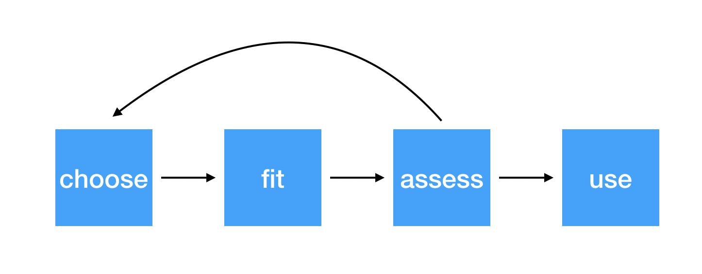
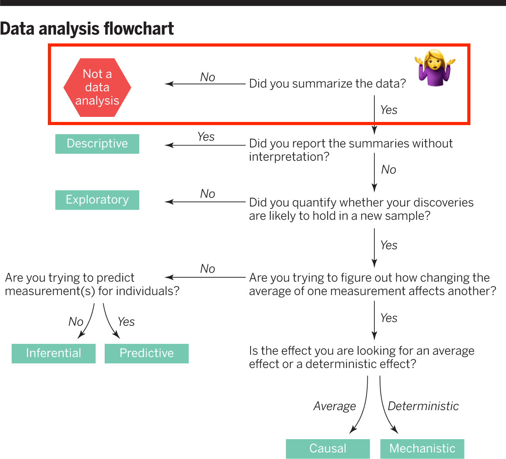
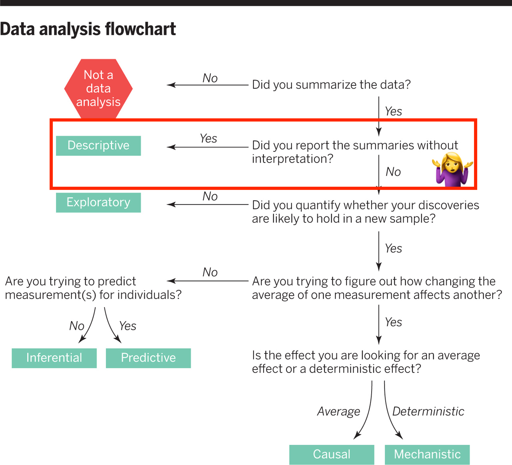
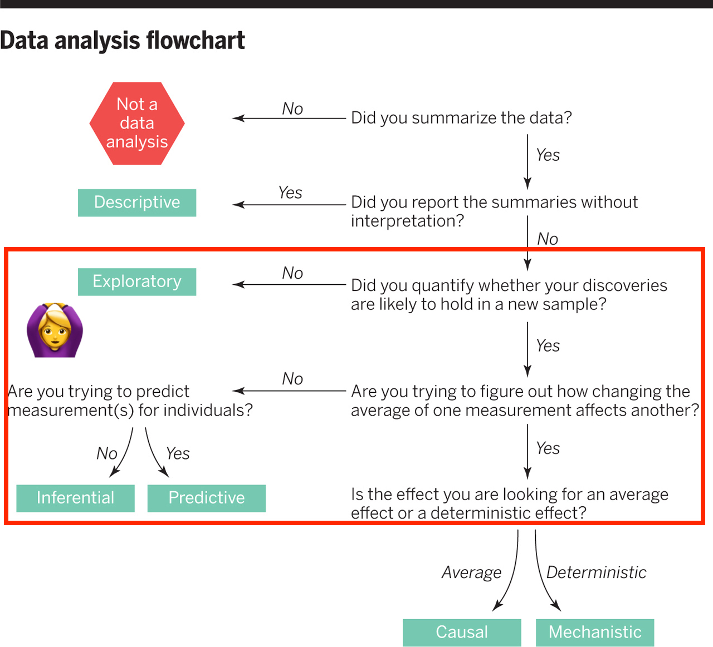
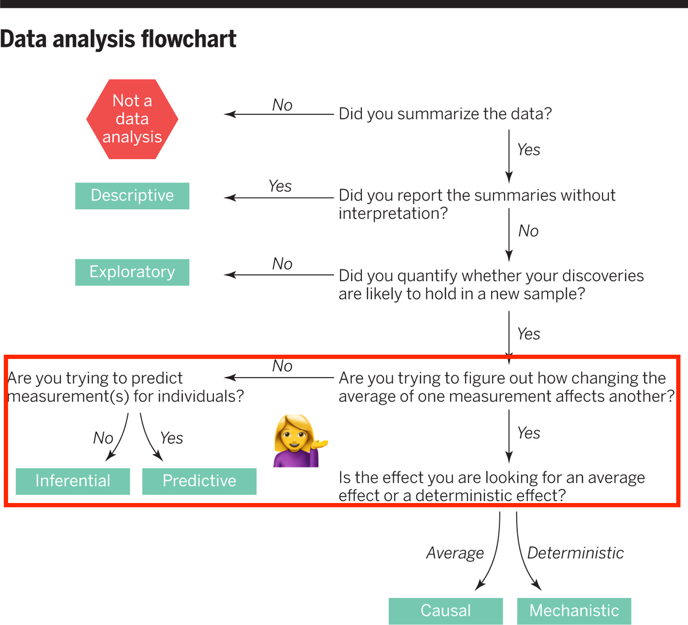

```{r child = "setup.Rmd"}
```
layout: true

<div class="my-footer">
<span>
by Dr. Lucy D'Agostino McGowan
</span>
</div> 

---

```{r, message = FALSE, warning = FALSE, echo = FALSE}
library(tidyverse)
```

# Steps for modeling



---

## Conditions for ordinary linear regression

* Linearity
* Zero Mean
* Constant Variance
* Independence
* Random
* Normality

---

## Conditions for ordinary linear regression

.small[
Assumption| What it means | How do you check? | How do you fix?
----|-----|-----------|-----
Linearity |The relationship between the outcome and explanatory variable or predictor is linear **holding all other variables constant**| Residuals vs. fits plot | fit a better model (transformations, polynomial terms, more / different variables, etc.)
Zero Mean | | |
]
---

## Conditions for ordinary linear regression


.small[
Assumption| What it means | How do you check? | How do you fix?
----|-----|-----------|-----
Linearity |The relationship between the outcome and explanatory variable or predictor is linear **holding all other variables constant**| Residuals vs. fits plot | fit a better model (transformations, polynomial terms, more / different variables, etc.)
Zero Mean | The error distribution is centered at zero | by default | --
Constant Variance | | |
]

---

## Conditions for ordinary linear regression

.small[
Assumption| What it means | How do you check? | How do you fix?
----|-----|-----------|-----
Linearity |The relationship between the outcome and explanatory variable or predictor is linear **holding all other variables constant**| Residuals vs. fits plot | fit a better model (transformations, polynomial terms, more / different variables, etc.)
Zero Mean | The error distribution is centered at zero | by default | --
Constant Variance | The variability in the errors is the same for all values of the predictor variable | Residuals vs fits plot | fit a better model
Independence | | |
]

---

## Conditions for ordinary linear regression


.small[
Assumption| What it means | How do you check? | How do you fix?
----|-----|-----------|-----
Linearity |The relationship between the outcome and explanatory variable or predictor is linear **holding all other variables constant**| Residuals vs. fits plot | fit a better model (transformations, polynomial terms, more / different variables, etc.)
Zero Mean | The error distribution is centered at zero | by default | --
Constant Variance | The variability in the errors is the same for all values of the predictor variable | Residuals vs fits plot | fit a better model
Independence | The errors are assumed to be independent from one another | `r emo::ji("eyes")` data generation | Find better data or fit a fancier model
Random | | |

]

---

## Conditions for ordinary linear regression

.small[
Assumption| What it means | How do you check? | How do you fix?
----|-----|-----------|-----
Linearity |The relationship between the outcome and explanatory variable or predictor is linear **holding all other variables constant**| Residuals vs. fits plot | fit a better model (transformations, polynomial terms, more / different variables, etc.)
Zero Mean | The error distribution is centered at zero | by default | --
Constant Variance | The variability in the errors is the same for all values of the predictor variable | Residuals vs fits plot | fit a better model
Independence | The errors are assumed to be independent from one another | `r emo::ji("eyes")` data generation | Find better data or fit a fancier model
Random | The data are obtained using a random process | `r emo::ji("eyes")` data generation | Find better data or fit a fancier model
Normality | | |
]

---

## Conditions for ordinary linear regression

.small[
Assumption| What it means | How do you check? | How do you fix?
----|-----|-----------|-----
Linearity |The relationship between the outcome and explanatory variable or predictor is linear **holding all other variables constant**| Residuals vs. fits plot | fit a better model (transformations, polynomial terms, more / different variables, etc.)
Zero Mean | The error distribution is centered at zero | by default | --
Constant Variance | The variability in the errors is the same for all values of the predictor variable | Residuals vs fits plot | fit a better model
Independence | The errors are assumed to be independent from one another | `r emo::ji("eyes")` data generation | Find better data or fit a fancier model
Random | The data are obtained using a random process | `r emo::ji("eyes")` data generation | Find better data or fit a fancier model
Normality | The random errors follow a normal distribution | QQ-plot / residual histogram | fit a better model
]

---

## Conditions for **logistic** regression

* Linearity
* Independence
* Randomness

---

## Conditions for **logistic** regression

.question[
How do we test linearity?
]
* **Linearity**
* Independence
* Randomness

---

## Conditions for **logistic** regression

.question[
How do we test linearity?
]
* **Linearity** `r emo::ji("check")` _Plot the empirical logits_
* Independence
* Randomness

---

## `r emo::ji("golf")` Testing for linearity in logistic regression 

* We can plot the **empirical logit** to examine the linearity assumption

Length | 3 | 4 | 5 | 6 | 7
------|----|---|---|---|---
Number of successes | 84 | 88 | 61 | 61 | 44 
Number of failures | 17 | 31 | 47 | 64 | 90 
Total | 101 | 119 | 108 | 125 | 134
Probability of success | 0.832 | 0.739 | 0.565 | 0.488 | 0.328
Odds of success | 4.941 | 2.839 | 1.298| 0.953| 0.489
Empirical logit | 1.60 | 1.04| 0.26 |−0.05 |−0.72

---

## `r emo::ji("golf")` Testing for linearity in logistic regression 

.small[
```{r, fig.height = 2}
data <- data.frame(
  length = c(3, 4, 5, 6, 7),
  emp_logit = c(1.6, 1.04, 0.26, -0.05, -0.72)
)
ggplot(data, aes(length, emp_logit)) + 
  geom_point() + 
  geom_abline(intercept = 3.26, slope = -0.566, lty = 2) +
  labs(y = "log odds of success")
```
]

---


# Conditions for **logistic** regression

* Linearity
* **Independence**
* **Randomness**

---

## Why do we care?



---

## Why do we care?



---

## Why do we care?



---

## Why do we care?



---

## Independence

* The observations should be _independent_ of one another
* In the Medical School Admission - GPA example, 55 students were randomly selected and their admission status and GPA were recorded: `r emo::ji("+1")` Independent or `r emo::ji("-1")` Not?

--
* `r emo::ji("+1")`

--
* A new treatment comes out to help with dry eyes. A sample of 25 people get randomized to either treatment or placebo - this creates a dataset of information about 50 eyes. `r emo::ji("+1")` or `r emo::ji("-1")` 

--
* `r emo::ji("-1")`

---

## Randomness

.question[
What do I put for the **family** argument if I want to fit a logistic regression in R?
]

```{r, eval = FALSE}
glm(am ~ mpg, data = mtcars,
    family = "---") #<<
```

---

## Randomness

.question[
What do I put for the **family** argument if I want to fit a logistic regression in R?
]

```{r, eval = FALSE}
glm(am ~ mpg, data = mtcars,
    family = "binomial") #<<
```

* The **binomial** distribution tells you the number of successes in $n$ experiments

--
* For the purposes of this class, $n$ will always be 1

--
* This is special case of the **binomial** distribution, called the **Bernoulli** distribution

--
* Why does this matter? R wants you to specify that you are using the `"binomial"` family, your book talks about the **Bernoulli** distribution, I just want to bridge the gap

---

## Randomness

_The Spinner_

* A random 0, 1 outcome that behaves like a "spinner" follows the **Bernoulli** distribution

--
* For example, in a fair coin toss, the probability of getting "heads" is 50%

```{r, echo = FALSE}
df <- data.frame(
  heads = c("Yes", "No"),
  value = c(50, 50)
)
ggplot(df, aes(x = "", y = value, fill = heads)) +
  geom_bar(width = 1, stat = "identity") +
  coord_polar("y", start = 10) + 
  scale_y_continuous("^")+
  theme(panel.background = element_blank(),
        axis.text = element_blank(),
        axis.title.y = element_blank(),
        axis.ticks = element_blank(),
        axis.title.x = element_text(size = 30, vjust = 4))
```

---

## Randomness

_The Spinner_

* A random 0, 1 outcome that behaves like a "spinner" follows the **Bernoulli** distribution
* For example, in a fair coin toss, the probability of getting "heads" is 50%

```{r, echo = FALSE}
df <- data.frame(
  heads = c("Yes", "No"),
  value = c(50, 50)
)
ggplot(df, aes(x = "", y = value, fill = heads)) +
  geom_bar(width = 1, stat = "identity") +
  coord_polar("y", start = 90) + 
  scale_y_continuous("^")+
  theme(panel.background = element_blank(),
        axis.text = element_blank(),
        axis.title.y = element_blank(),
        axis.ticks = element_blank(),
        axis.title.x = element_text(size = 30, vjust = 4))
```

---

## Randomness

_The Spinner_

* A random 0, 1 outcome that behaves like a "spinner" follows the **Bernoulli** distribution
* For example, in a fair coin toss, the probability of getting "heads" is 50%

```{r, echo = FALSE}
df <- data.frame(
  heads = c("Yes", "No"),
  value = c(50, 50)
)
ggplot(df, aes(x = "", y = value, fill = heads)) +
  geom_bar(width = 1, stat = "identity") +
  coord_polar("y", start = 40) + 
  scale_y_continuous("^")+
  theme(panel.background = element_blank(),
        axis.text = element_blank(),
        axis.title.y = element_blank(),
        axis.ticks = element_blank(),
        axis.title.x = element_text(size = 30, vjust = 4))
```

---

## Randomness

_The Spinner_

* A random 0, 1 outcome that behaves like a "spinner" follows the **Bernoulli** distribution
* For example, in a fair coin toss, the probability of getting "heads" is 50%

```{r, echo = FALSE}
df <- data.frame(
  heads = c("Yes", "No"),
  value = c(50, 50)
)
ggplot(df, aes(x = "", y = value, fill = heads)) +
  geom_bar(width = 1, stat = "identity") +
  coord_polar("y", start = 60) + 
  scale_y_continuous("^")+
  theme(panel.background = element_blank(),
        axis.text = element_blank(),
        axis.title.y = element_blank(),
        axis.ticks = element_blank(),
        axis.title.x = element_text(size = 30, vjust = 4))
```

---

## Randomness

_The Spinner_

* A random 0, 1 outcome that behaves like a "spinner" follows the **Bernoulli** distribution
* In the Medical school admissions - GPA example, a student with a 3.8 has an 82% chance of acceptance

```{r, echo = FALSE}
df <- tibble(
  `Accepted to Medical School` = c("Yes", "No"),
  value = c(82, 100-82)
)
ggplot(df, aes(x = "", y = value, fill = `Accepted to Medical School`)) +
  geom_bar(width = 1, stat = "identity") +
  coord_polar("y", start = 90) + 
  scale_y_continuous("^")+
  theme(panel.background = element_blank(),
        axis.text = element_blank(),
        axis.title.y = element_blank(),
        axis.ticks = element_blank(),
        axis.title.x = element_text(size = 30, vjust = 4))
```

---


## Randomness

_The Spinner_

* A random 0, 1 outcome that behaves like a "spinner" follows the **Bernoulli** distribution
* In the Medical school admissions - GPA example, a student with a 3.8 has an 82% chance of acceptance

```{r, echo = FALSE}
df <- tibble(
  `Accepted to Medical School` = c("Yes", "No"),
  value = c(82, 100-82)
)
ggplot(df, aes(x = "", y = value, fill = `Accepted to Medical School`)) +
  geom_bar(width = 1, stat = "identity") +
  coord_polar("y", start = 20) + 
  scale_y_continuous("^")+
  theme(panel.background = element_blank(),
        axis.text = element_blank(),
        axis.title.y = element_blank(),
        axis.ticks = element_blank(),
        axis.title.x = element_text(size = 30, vjust = 4))
```

---

## Randomness

_The Spinner_

* A random 0, 1 outcome that behaves like a "spinner" follows the **Bernoulli** distribution
* In the Medical school admissions - GPA example, a student with a 3.8 has an 82% chance of acceptance

```{r, echo = FALSE}
df <- tibble(
  `Accepted to Medical School` = c("Yes", "No"),
  value = c(82, 100-82)
)
ggplot(df, aes(x = "", y = value, fill = `Accepted to Medical School`)) +
  geom_bar(width = 1, stat = "identity") +
  coord_polar("y", start = 40) + 
  scale_y_continuous("^")+
  theme(panel.background = element_blank(),
        axis.text = element_blank(),
        axis.title.y = element_blank(),
        axis.ticks = element_blank(),
        axis.title.x = element_text(size = 30, vjust = 4))
```

---

## Randomness

_The Spinner_

* A random 0, 1 outcome that behaves like a "spinner" follows the **Bernoulli** distribution
* In the Medical school admissions - GPA example, a student with a 3.8 has an 82% chance of acceptance

```{r, echo = FALSE}
df <- tibble(
  `Accepted to Medical School` = c("Yes", "No"),
  value = c(82, 100-82)
)
ggplot(df, aes(x = "", y = value, fill = `Accepted to Medical School`)) +
  geom_bar(width = 1, stat = "identity") +
  coord_polar("y", start = 5) + 
  scale_y_continuous("^")+
  theme(panel.background = element_blank(),
        axis.text = element_blank(),
        axis.title.y = element_blank(),
        axis.ticks = element_blank(),
        axis.title.x = element_text(size = 30, vjust = 4))
```

---

## Randomness

_The Spinner_

* A random 0, 1 outcome that behaves like a "spinner" follows the **Bernoulli** distribution
* In the Medical school admissions - GPA example, a student with a 3.8 has an 82% chance of acceptance

```{r, echo = FALSE}
df <- tibble(
  `Accepted to Medical School` = c("Yes", "No"),
  value = c(82, 100-82)
)
ggplot(df, aes(x = "", y = value, fill = `Accepted to Medical School`)) +
  geom_bar(width = 1, stat = "identity") +
  coord_polar("y", start = 180) + 
  scale_y_continuous("^")+
  theme(panel.background = element_blank(),
        axis.text = element_blank(),
        axis.title.y = element_blank(),
        axis.ticks = element_blank(),
        axis.title.x = element_text(size = 30, vjust = 4))
```
