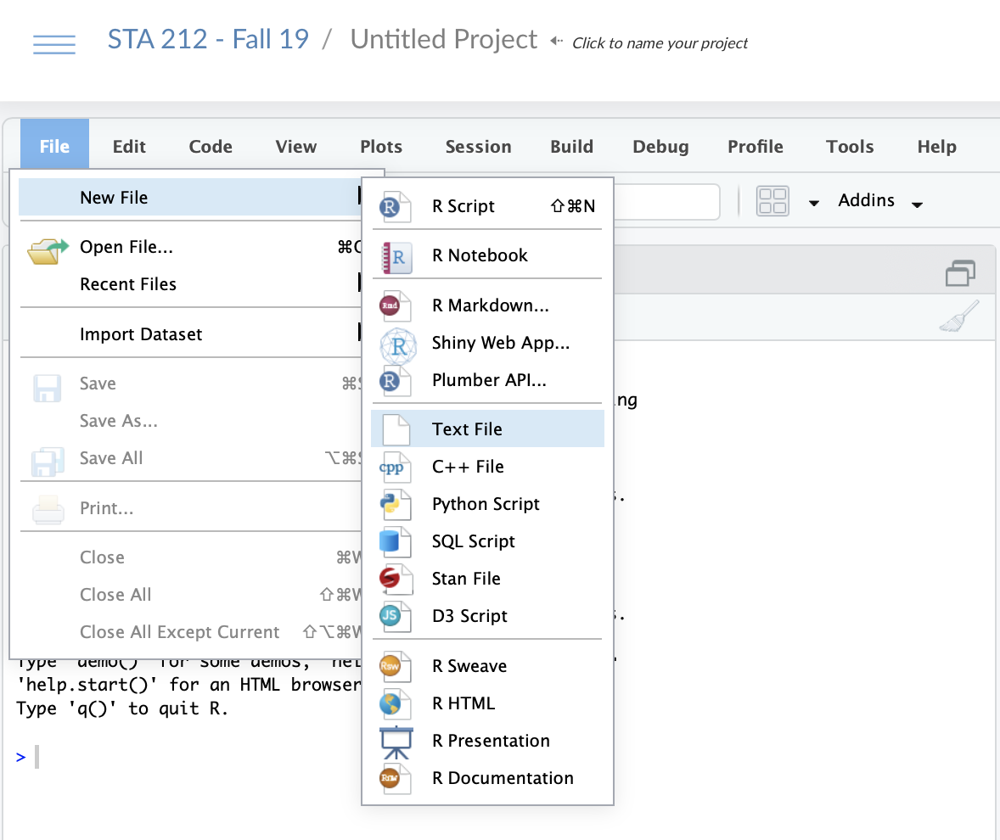
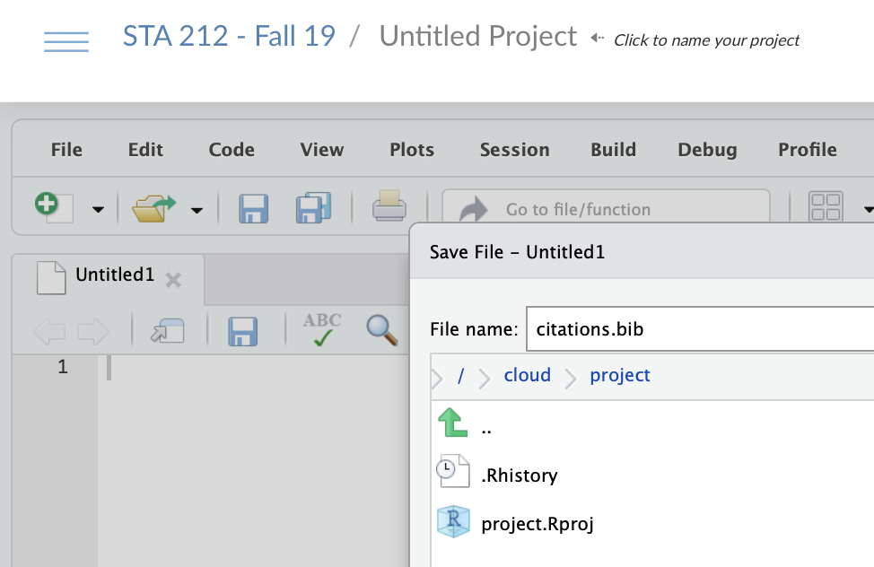
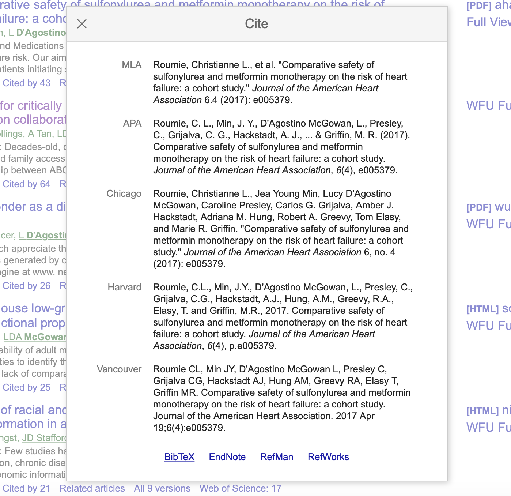
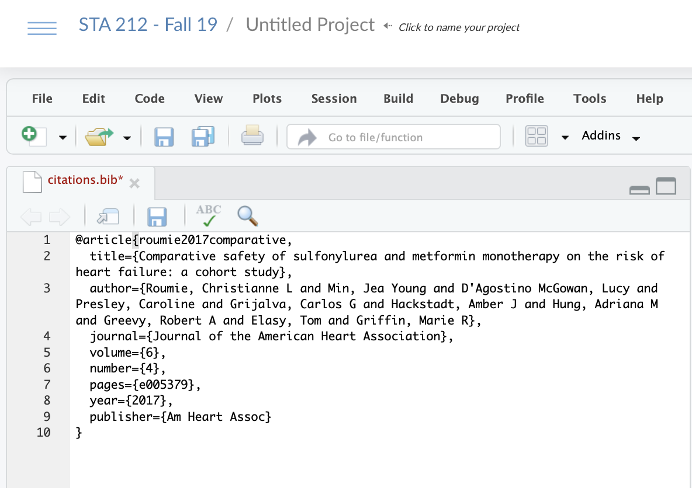

```{r child = "setup.Rmd"}
```
layout: true

<div class="my-footer">
<span>
by Dr. Lucy D'Agostino McGowan
</span>
</div> 

---

```{r, message = FALSE, warning = FALSE, echo = FALSE}
library(tidyverse)
library(broom)
library(knitr)
options(digits = 3)
```

## Agenda

* Updating your `yaml` 
* Putting all code in the appendix
* Hiding messages and warnings from your package loadings
* Hiding interactive output
* Creating pretty tables
* Creating figure and table caption
* Putting intermediate figures at the end
* Including citations

---

## Updating your `yaml`

* For the final project I want you to create .pdf files.

```{yaml}
---
title: "The title of your document"
name: "Your name"
output: pdf_document #<<
---
```

---

## Updating your `yaml`

* For the final project I want you to create .pdf files.

```{yaml}
---
title: "The title of your document"
name: "Your name"
output: pdf_document 
fontsize: 12pt #<<
---
```

* 12 pt font

---

## Updating your `yaml`

* For the final project I want you to create .pdf files.

```{yaml}
---
title: "The title of your document"
name: "Your name"
output: pdf_document 
fontsize: 12pt
linestretch: 2 #<<
---
```

* 12 pt font
* Double spaced

---

## Putting all code in the Appendix

* For these fancy reports, we want to see the R code, but we don't want it intersperced throughout the document. 
* You can "hide" all of your chunks by adding this to the top of your .Rmd file

.small[
````
`r ''````{r, echo = FALSE}
library(knitr)
opts_chunk$set(echo = FALSE)
```
````
]

--

* **THEN** at the end of you document (in the Appendix) you can add

.small[
````
`r ''````{r ref.label=knitr::all_labels(), echo = TRUE, eval = FALSE}
```
````
]

---

## Hiding messages and warnings from your package loadings

* You can hide any messages or warnings by updating the chunk options

.small[
````
`r ''````{r, echo = FALSE}
library(knitr)
opts_chunk$set(echo = FALSE, message = FALSE, warning = FALSE)
```
````
]

---

## Hiding interactive output

* If you are running "interactive code", that is code that is not saved to an object in `R`, it will print in your output, even if you hide the _code_ with `echo = FALSE`. For example:

.small[
```{r}
glimpse(iris)
```
]

--

* Use the `results = "hide"` in the chunk options to _hide_ it.

.small[
````
`r ''````{r, results = "hide"}
glimpse(iris)
```
````
]

---

## Creating pretty tables

* We've been using the `tidy()` and `glance()` functions to print tables of our model output.
* These kind of look like "code" in our final reports
* We can make these prettier with the **knitr** package

--
* Load the **knitr** package with `library(knitr)`
* Use the `kable()` function to output a pretty table

.small[
```{r, eval = FALSE}
library(knitr) #<<
lm(wt ~ am, data = mtcars) %>%
  tidy() %>%
  kable() #<<
```
]
.small[
```{r, echo = FALSE, warning = FALSE, message = FALSE}
library(knitr) 
lm(wt ~ am, data = mtcars) %>%
  tidy() %>%
  kable(format = "html") 
```
]
---

## Creating table captions


.small[
```{r, eval = FALSE}
library(knitr) 
lm(wt ~ am, data = mtcars) %>%
  tidy() %>%
  kable(caption = "Predicting Car's weight from transmission type") #<<
```
]
.small[
```{r, echo = FALSE, warning = FALSE, message = FALSE}
library(knitr) 
lm(wt ~ am, data = mtcars) %>%
  tidy() %>%
  kable(format = "html", caption = "Table 1. Predicting Car's weight from transmission type") 
```
]
---

## Creating figure captions

* If you have an `R` chunck that produces a Figure, you can caption it using the `fig.cap` chunk option. For example:

.small[
```{r, fig.cap = "Scatterplot of Miles per gallon by Displacement", fig.height = 1.5}
ggplot(mtcars, aes(x = mpg, y = disp)) +
  geom_point()
```
]
.center[Figure 1. Scatterplot of Miles per gallon by Displacement]

.small[
````
`r ''````{r, fig.cap = "Scatterplot of Miles per gallon by Displacement"}
ggplot(mtcars, aes(x = mpg, y = disp)) +
  geom_point()
```
````
]

---

## Putting extra figures at the end of your document

* Your prompt tells you to put all "intermediate" figures in the appendix
  * This includes figures that you used to check the assumptions of the models that were _not_ the final model
* To do this:
  * Save your figures as `R` objects
  * Create code chunks at the **beginning** of the Appendix that run these objects (with captions)

---

## Putting extra figures at the end of your document

* Save the plot to an `R` object, `p`

```{r}
p <- ggplot(mtcars, aes(mpg, disp)) +
  geom_point()
```

--

* Put this `R` object, `p` in a chunk at the beginning of your Appendix

.small[
````
`r ''````{r, fig.cap = "Scatterplot of Miles per gallon by Displacement"}
p
```
````
]

---

## Citations

* Your introduction should cite prior research in the area of your research question
* You will need to create a `citations.bib` file with citations, and then reference them using `[@citation]`

---

## Citations 

* Create a `citations.bib` file in your RStudio project
  * Go to File > New File > Text File and click
  
.center[

]

---

## Citations

* Create a `citations.bib` file in your RStudio project
  * Go to File > New File > Text File and click
  * Save the file as `citations.bib`

.center[

]

---

## Citations

* This bibliography is using `BibTex`, which is a certain way citations are saved in Latex
* Your `citations.bib` is going to be a file with multiple `BibTex` entries
* You can get `Bibtex` entries from Google Scholar
  * Search for the article you'd like to cite
  * Under the article there will be `"`, click that
  
.center[

]

---

## Citations


* This bibliography is using `BibTex`, which is a certain way citations are saved in Latex
* Your `citations.bib` is going to be a file with multiple `BibTex` entries
* You can get `Bibtex` entries from Google Scholar
  * Search for the article you'd like to cite
  * Under the article there will be `"`, click that
  * A window will pop up with several citation styles, click `BibTex` on the bottom

---

## Citations

</img>

---


## Citations


* This bibliography is using `BibTex`, which is a certain way citations are saved in Latex
* Your `citations.bib` is going to be a file with multiple `BibTex` entries
* You can get `Bibtex` entries from Google Scholar
  * Search for the article you'd like to cite
  * Under the article there will be `"`, click that
  * A window will pop up with several citation styles, click `BibTex` on the bottom
  * Copy the text in the window that pops up into your `citations.bib` file in RStudio

---

## Citations



---

## Citations

* The first argument of this citation is the reference **key** that you will use in your main document. Here it is `roumie2017comparative`

```
@article{roumie2017comparative,
  title={Comparative safety of sulfonylurea and metformin monotherapy on the risk of heart failure: a cohort study},
  author={Roumie, Christianne L and Min, Jea Young and D'Agostino McGowan, Lucy and Presley, Caroline and Grijalva, Carlos G and Hackstadt, Amber J and Hung, Adriana M and Greevy, Robert A and Elasy, Tom and Griffin, Marie R},
  journal={Journal of the American Heart Association},
  volume={6},
  number={4},
  pages={e005379},
  year={2017},
  publisher={Am Heart Assoc}
}
```
 
---

## Citations

* Go back to your final report document
* Add the `citations.bib` file to your `yaml`

```{yaml}
---
title: "The title of your document"
name: "Your name"
output: pdf_document 
fontsize: 12pt
linestretch: 2 
bibliography: citations.bib #<<
---
```

---

## Citations

* Go back to your final report document
* Add the `citations.bib` file to your `yaml`
* When you want to cite this paper in the main text, use the **key** like this: `[@roumie2017comparative]`
* At the **VERY** end of your document (after the Appendix, after your code chunks) add this header:

```
## References
```
---

## Citations

* What if the thing you want to cite isn't on Google Scholar?
* Generate a `BibTex` object here:

[http://www.citationmachine.net/bibtex/cite-a-website](http://www.citationmachine.net/bibtex/cite-a-website)

---

## Citations

* The first line of your results should say
"All analysis is completed in R" and then cite the R packages you used.
* Run this to get the citation:
```
print(citation("tidyverse"), bibtex = TRUE)
```* Make sure there is a reference **key**, if not add one.

.small[
```
@Manual{,
    title = {tidyverse: Easily Install and Load the 'Tidyverse'},
    author = {Hadley Wickham},
    year = {2017},
    note = {R package version 1.2.1},
    url = {https://CRAN.R-project.org/package=tidyverse},
  }
```
]

---

## Citations

* The first line of your results should say
"All analysis is completed in R"`[@tidyverse]` and then cite the R packages you used.
* Run this to get the citation:
```
print(citation("tidyverse"), bibtex = TRUE)
```
* Make sure there is a reference **key**, if not add one.

.small[
```
@Manual{tidyverse,
    title = {tidyverse: Easily Install and Load the 'Tidyverse'},
    author = {Hadley Wickham},
    year = {2017},
    note = {R package version 1.2.1},
    url = {https://CRAN.R-project.org/package=tidyverse},
  }
```
]

---

## Citations

* The first line of your results should say
"All analysis is completed in R"`[@tidyverse; @broom]` and then cite the R packages you used.
* For more than one, seperate with a `;`
* Run this to get the citation:
```
print(citation("broom"), bibtex = TRUE)
```
* Make sure there is a reference **key**, if not add one.

---

## <i class="fas fa-laptop"></i> Rstudio Cloud

* Open your project for the final report
* Update the `yaml` to include 12 pt font, double spacing, and a bibliography
* Practice creating figure captions
* Practice adding figures to the Appendix
* Create a `citations.bib` file
* Practice citing an article
